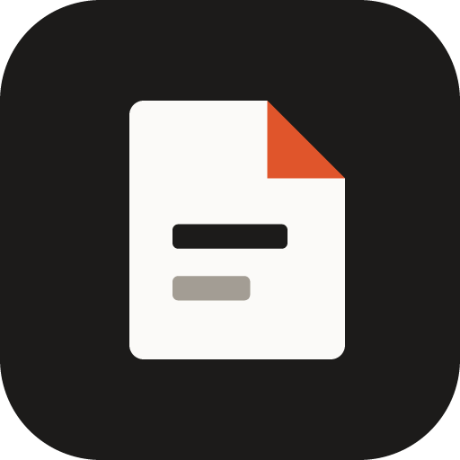
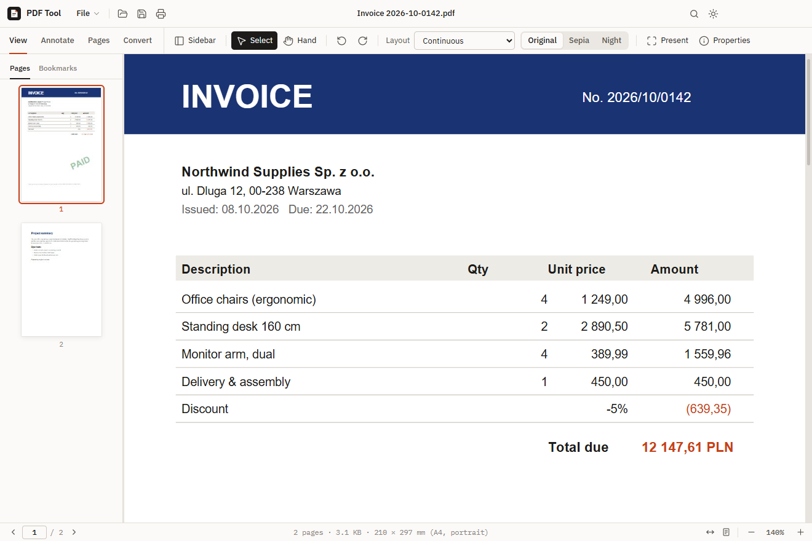
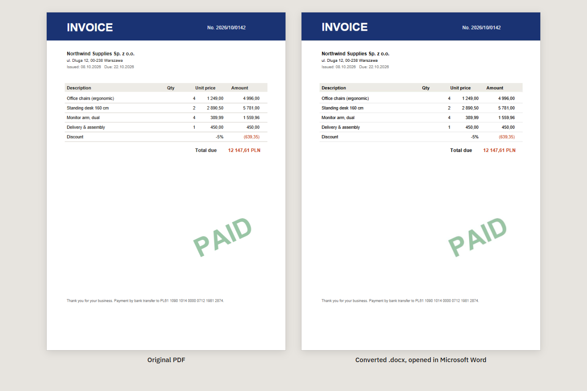
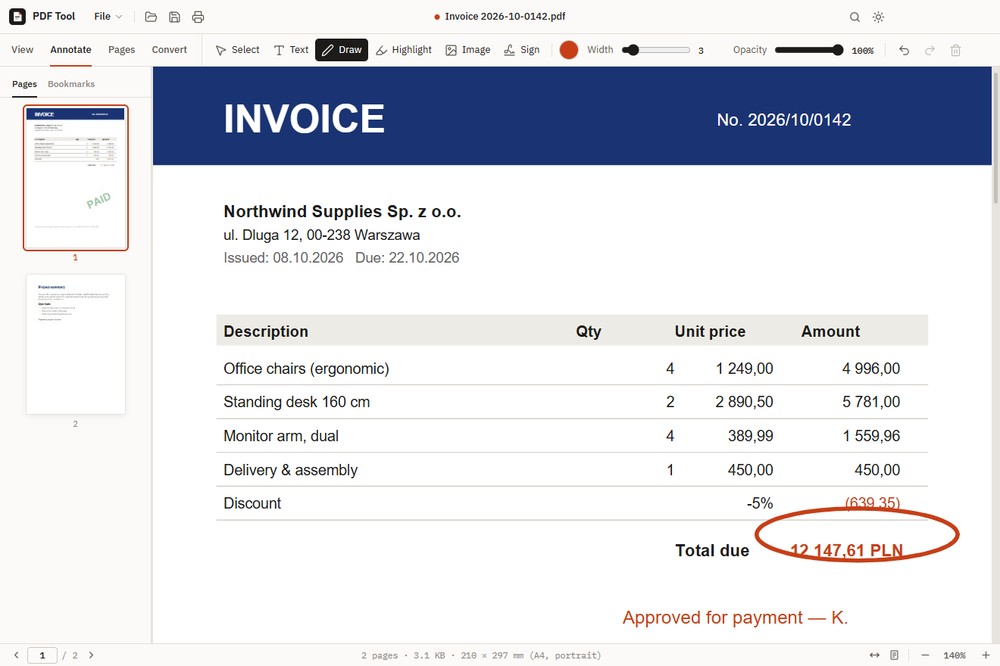
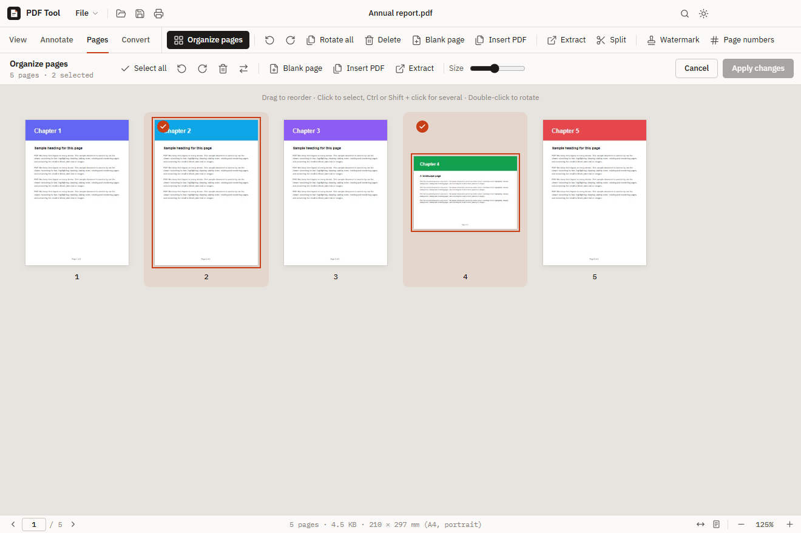
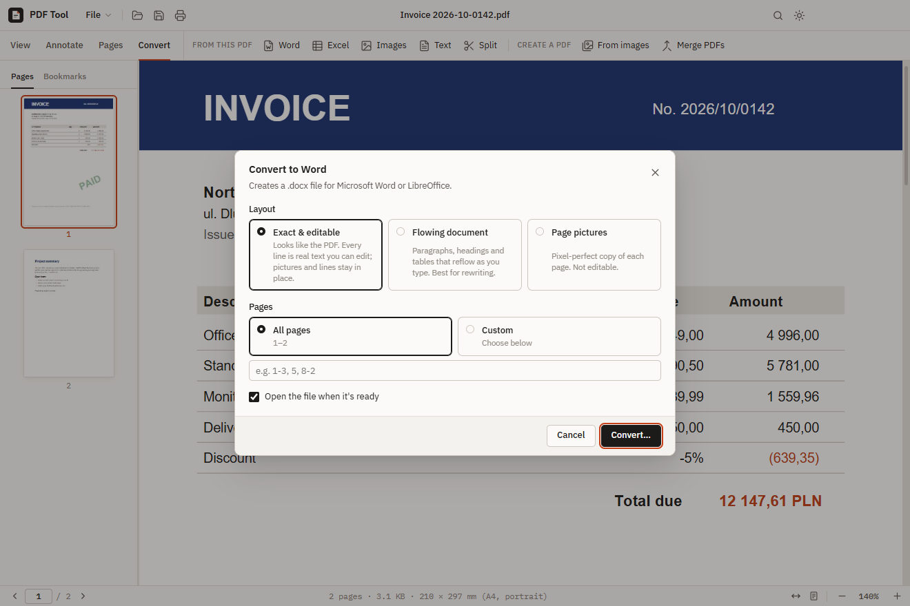
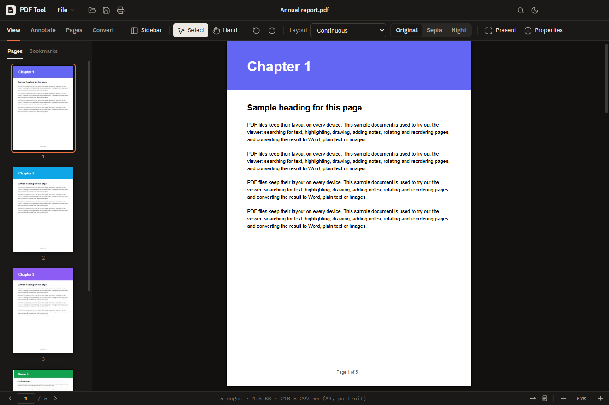

<p align="center">
  
</p>

<h1 align="center">PDF Tool</h1>

<p align="center">
  A free Windows app to read, annotate, sign, rearrange and convert PDF files.<br>
  Its PDF → Word conversion keeps the exact layout <em>and</em> stays editable.
</p>

<p align="center">
  <a href="../../releases/latest"><b>Download for Windows</b></a> ·
  <a href="#features">Features</a> ·
  <a href="#install">Install</a> ·
  <a href="#how-to">How to</a> ·
  <a href="#build-from-source">Build from source</a>
</p>



Everything runs on your computer. No account, no upload, no internet connection needed —
your documents never leave your PC.

## Features

| | |
| --- | --- |
| **Read** | Fast, sharp rendering (Mozilla's PDF.js, the engine in Firefox) · page thumbnails and bookmarks · search with highlighting · zoom, fit width / page · continuous, single-page, grid and two-page layouts · Sepia and Night page colours · presentation mode · light and dark theme |
| **Annotate & sign** | Text boxes · freehand drawing · highlighter · images · signatures (draw, type, or upload a photo — the white background is removed automatically) · undo/redo · saved into the PDF as standard annotations other readers can see |
| **Pages** | Drag-and-drop page organizer · rotate · delete · insert blank pages or another PDF · extract pages · split into several files · watermark (any language) · page numbers · edit title/author |
| **Convert** | PDF → Word (3 layouts, see below) · PDF → Excel · PDF → PNG/JPG · PDF → text · images → PDF · merge PDFs |

### PDF → Word that looks like the original



Choose one of three layouts when you convert:

- **Exact & editable** *(default)* — the Word file looks like the PDF. Every line is real Word text you
  can edit, in its original position, font, size and colour. Pictures, lines and coloured areas stay in
  place behind the text. Rotated text, like the “PAID” stamp above, stays part of the picture.
- **Flowing document** — paragraphs, headings, lists and real Word tables that reflow as you type.
  Best when you want to rewrite the content.
- **Page pictures** — a pixel-perfect copy of each page. Not editable.

### PDF → Excel

Finds the rows and columns of tables and puts them into cells. Amounts become real numbers you can
calculate with — `1 234,56`, `1,234.56`, `15%` and `(120)` (negative) are all recognised — and bold
headers stay bold. Get one worksheet per page, or everything on one sheet for tables that continue
across pages.

### Annotate and sign



### Organize pages



### Convert



### Dark mode



## Install

1. Download **`PDF-Tool-Setup-<version>.exe`** from the [latest release](../../releases/latest).
   Prefer not to install? Download **`PDF-Tool-Portable-<version>.exe`** and run it directly.
2. Run it. You can choose the install folder; it adds Start menu and desktop shortcuts.
3. Windows may show *“Windows protected your PC”*, because the app isn't code-signed.
   Click **More info → Run anyway**.

**Open PDFs with PDF Tool by double-click:** right-click any PDF → **Open with → Choose another app →
PDF Tool**, tick **Always**.

Requires Windows 10 or 11 (64-bit).

## How to

| I want to… | Do this |
| --- | --- |
| Open a PDF | **Ctrl+O**, drop the file on the window, or use *Recent* on the start screen |
| Fill in, write on or highlight a PDF | **Annotate** tab → *Text*, *Draw* or *Highlight*. Click an annotation later to move, restyle or delete it |
| Sign a document | **Annotate → Sign**, then drag the signature into place. Tick *Remember* to reuse it next time |
| Reorder, rotate or delete pages | **Pages → Organize pages**, drag pages around, then *Apply changes* |
| Take some pages out | **Pages → Extract** (e.g. `1-3, 7`) or *Split* into several files |
| Turn a PDF into Word / Excel | **Convert → Word** or **Excel**. Choose where to save; the file opens when it's ready |
| Make one PDF from photos or scans | **Convert → From images** (or drop images on the window) |
| Combine several PDFs | **Convert → Merge PDFs** (or drop several PDFs on the window) |
| Undo a page change | Click **Undo** in the notification that appears after the change |
| Save | **Ctrl+S** saves in place, **Ctrl+Shift+S** saves a copy. You're asked before closing with unsaved changes |

### Keyboard shortcuts

| Action | Keys |
| --- | --- |
| Open · Save · Save as | Ctrl+O · Ctrl+S · Ctrl+Shift+S |
| Print · Find | Ctrl+P · Ctrl+F |
| Zoom | Ctrl + / Ctrl − / Ctrl+0, or Ctrl + mouse wheel |
| Organize pages | Ctrl+Shift+O |
| Presentation | F5 (Esc to leave) |
| Stop annotating | Esc |
| Undo / redo an annotation | Ctrl+Z / Ctrl+Y |
| New window · Close document | Ctrl+N · Ctrl+W |

## Good to know

- **Scanned PDFs** (photos of paper) have no text inside, so they convert to Word and Excel as
  pictures. Text recognition (OCR) is not included.
- **Exact & editable Word files** position text with Word *frames*. Microsoft Word and LibreOffice
  show them exactly; Google Docs doesn't support frames — use *Flowing document* there.
- **Fonts:** if a PDF uses a font that isn't installed on your PC, Word shows a similar one; the
  layout stays the same.
- **Excel** reads columns from how the text lines up, which works well for normal tables. Merged
  cells or text wrapped inside a cell can become extra rows.
- **Password-protected PDFs** can be opened, read and annotated, but their pages can't be rearranged.

## Build from source

You need [Node.js](https://nodejs.org/) 22 or newer.

```bash
npm install
npm start               # build and launch the app
npm run dist            # Windows installer → release/
npm run dist:portable   # portable .exe → release/
npm run dev:web         # UI preview in a browser at http://localhost:5199
```

| Path | Contents |
| --- | --- |
| `electron/main.js` | App window, file dialogs, file-access allow-list, recent files |
| `electron/preload.js` | The small API the interface may call (`window.pdftool`) |
| `src/app.js` | Interface: viewer, tools, dialogs, shortcuts |
| `src/layout.js` | Page analysis — text lines with real fonts and colours, text-free background, table columns |
| `src/office.js` | Word (.docx) and Excel (.xlsx) writers |
| `src/pdf-ops.js` | Page editing with pdf-lib — rotate, reorder, merge, split, watermark, numbers, images → PDF |
| `src/convert.js` | Rendering, thumbnails, PDF → images / text |
| `src/organizer.js`, `src/signature.js` | Page organizer and signature pad |
| `src/styles.css` | Design (IBM Plex type, light and dark themes) |
| `scripts/` | Build script, icon generator, sample/test PDF generators |

**Security:** the interface runs sandboxed with context isolation; it can only read and write files you
picked in a dialog, opened, or dropped. Links inside PDFs open in your normal browser.

## Built with

[PDF.js](https://github.com/mozilla/pdf.js) (Apache-2.0) ·
[pdf-lib](https://github.com/Hopding/pdf-lib) (MIT) ·
[docx](https://github.com/dolanmiu/docx) (MIT) ·
[JSZip](https://github.com/Stuk/jszip) (MIT) ·
[Electron](https://www.electronjs.org/) (MIT) ·
[IBM Plex](https://github.com/IBM/plex) (SIL OFL)

## License

[MIT](LICENSE)
