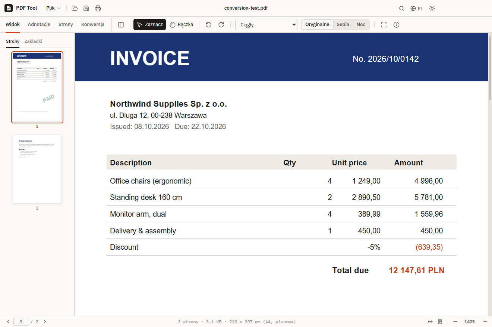
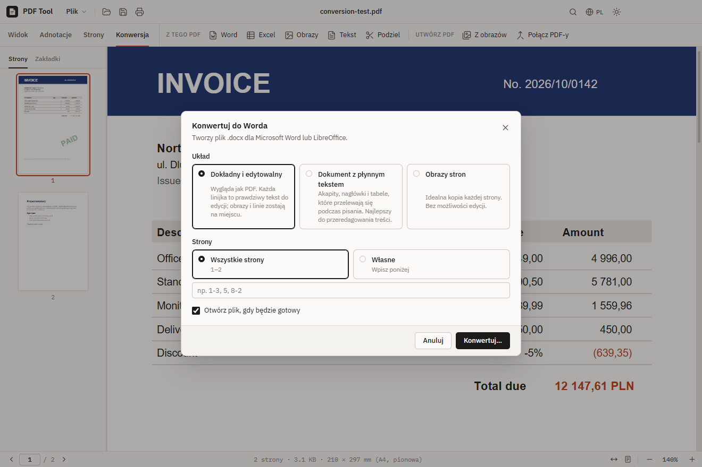

<p align="center">
  
</p>

<h1 align="center">PDF Tool</h1>

<p align="center">
  <b>Darmowa aplikacja do plików PDF dla Windows — open source</b><br>
  Czytaj, dodawaj notatki, podpisuj, porządkuj strony i konwertuj PDF-y —<br>
  także do Worda z zachowaniem dokładnego układu <em>i</em> możliwością edycji.
</p>

<p align="center">
  Autor: <a href="https://www.aievolutionpolska.pl"><b>AI Evolution Polska</b></a>
</p>

<p align="center">
  <a href="https://github.com/aievolutionpl/PDFTool/releases/latest/download/PDF-Tool-Setup.exe"></a>
  &nbsp;
  <a href="https://github.com/aievolutionpl/PDFTool/releases/latest/download/PDF-Tool-Portable.exe"></a>
</p>

<p align="center">
  <a href="https://github.com/aievolutionpl/PDFTool/releases/latest"></a>
  
  <a href="LICENSE"></a>
  <a href="https://github.com/aievolutionpl/PDFTool/releases"></a>
</p>

<p align="center">
  <a href="README.md">English</a> · <b>Polski</b>
</p>



PDF Tool to aplikacja na komputer do codziennej pracy z plikami PDF: otwieranie i czytanie, pisanie
i rysowanie na dokumentach, podpisywanie, układanie stron oraz zamiana na Worda, Excela lub obrazy.
Jest darmowa, bez reklam i bez zakładania konta, a wszystko dzieje się na Twoim komputerze —
dokumenty nigdy nie są nigdzie wysyłane.

## Instalacja w 3 krokach

1. **Pobierz** — kliknij **[Pobierz instalator](https://github.com/aievolutionpl/PDFTool/releases/latest/download/PDF-Tool-Setup.exe)**
   (plik `PDF-Tool-Setup.exe`, ok. 108 MB).
2. **Otwórz pobrany plik.** Windows może pokazać niebieskie okno *„System Windows ochronił ten komputer”*.
   Kliknij **Więcej informacji**, a potem **Uruchom mimo to**.
   <br><sub>Ten komunikat pojawia się, bo aplikacja nie ma płatnego certyfikatu podpisu — to normalne w darmowym oprogramowaniu open source. Cały kod źródłowy jest w tym repozytorium.</sub>
3. **Przejdź przez instalator** (wyświetla się w języku Windows): zostaw zaznaczone **Tylko dla mnie** →
   **Dalej** → zostaw proponowany folder → **Zainstaluj** → **Zakończ**.
   PDF Tool uruchomi się sam, a skrót znajdziesz w menu Start i na pulpicie.
   <br><sub>Na angielskim Windowsie przyciski to: Only for me → Next → Install → Finish.</sub>

Przy opcji *Tylko dla mnie* nie są potrzebne uprawnienia administratora.

> **Interfejs po polsku:** aplikacja startuje po angielsku. Kliknij przycisk **EN** w prawym górnym rogu
> okna i wybierz **Polski** — wybór zostanie zapamiętany. Otwarty dokument zostanie na swoim miejscu.

<details>
<summary><b>Otwieraj wszystkie PDF-y w PDF Tool</b></summary>

Kliknij prawym przyciskiem dowolny plik PDF → **Otwórz za pomocą** → **Wybierz inną aplikację** →
zaznacz **PDF Tool** → kliknij **Zawsze**. Od teraz dwuklik na PDF otworzy go w PDF Tool.
</details>

<details>
<summary><b>Bez instalacji — wersja przenośna</b></summary>

Pobierz **[PDF-Tool-Portable.exe](https://github.com/aievolutionpl/PDFTool/releases/latest/download/PDF-Tool-Portable.exe)**
i kliknij go dwa razy. Nic się nie instaluje, więc działa też z pendrive’a albo na komputerze, na którym
nie możesz instalować programów.
</details>

<details>
<summary><b>Aktualizacja i odinstalowanie</b></summary>

- **Aktualizacja:** pobierz najnowszy instalator z linku powyżej i uruchom go — zastąpi starą wersję,
  a ustawienia i lista ostatnich plików zostaną. Wszystkie wersje są na stronie
  [Releases](https://github.com/aievolutionpl/PDFTool/releases).
- **Odinstalowanie:** **Ustawienia** systemu Windows → **Aplikacje** → **Zainstalowane aplikacje** →
  **PDF Tool** → **Odinstaluj**.
</details>

Wymagania: Windows 10 lub 11, 64-bitowy.

## Co potrafi

| | |
| --- | --- |
| **Czytanie** | Szybkie i ostre wyświetlanie (PDF.js od Mozilli — silnik z Firefoksa) · miniatury stron i zakładki · wyszukiwanie z podświetleniem · powiększenie, dopasowanie do szerokości / strony · widok ciągły, pojedyncza strona, siatka i dwie strony · tryby sepii i nocny · tryb prezentacji · jasny i ciemny motyw |
| **Notatki i podpis** | Pola tekstowe · rysowanie odręczne · zakreślacz · obrazy · podpis (narysuj, wpisz albo wgraj zdjęcie — białe tło usuwa się samo) · cofnij/ponów · wszystko zapisuje się w PDF-ie, więc widać to także w innych czytnikach |
| **Strony** | Organizator stron z przeciąganiem · obracanie · usuwanie · wstawianie pustych stron lub innego PDF-a · wyodrębnianie stron · dzielenie na kilka plików · znak wodny (w każdym języku) · numeracja stron · edycja tytułu i autora |
| **Konwersja** | PDF → Word (3 układy) · PDF → Excel · PDF → PNG/JPG · PDF → tekst · obrazy → PDF · łączenie PDF-ów |
| **Język** | Polski i angielski — przełączasz przyciskiem **EN / PL** na pasku tytułu |

### PDF → Word, który wygląda jak oryginał


Przy konwersji wybierasz jeden z trzech układów:

- **Dokładny i edytowalny** *(domyślny)* — plik Worda wygląda jak PDF. Każda linijka
  to prawdziwy tekst w Wordzie, który możesz edytować — w tym samym miejscu, tą samą czcionką, rozmiarem
  i kolorem. Obrazy, linie i kolorowe tła zostają na swoim miejscu pod tekstem. Obrócony tekst, np.
  pieczątka „PAID” powyżej, zostaje częścią obrazu.
- **Dokument z płynnym tekstem** — akapity, nagłówki, listy i prawdziwe tabele
  Worda, które przelewają się podczas pisania. Najlepszy, gdy chcesz przepisać treść.
- **Obrazy stron** — idealna kopia każdej strony jako obraz. Bez edycji.

### PDF → Excel

Znajduje wiersze i kolumny tabel i wpisuje je do komórek. Kwoty stają się prawdziwymi liczbami, na
których można liczyć — rozpoznaje `1 234,56`, `1,234.56`, `15%` i `(120)` (liczba ujemna) — a
pogrubione nagłówki zostają pogrubione. Możesz dostać jeden arkusz na stronę albo wszystko w jednym
arkuszu, gdy tabela ciągnie się przez kilka stron.

### Notatki i podpis


### Organizowanie stron


### Konwersja



### Tryb ciemny


## Jak to zrobić

Nazwy przycisków dotyczą polskiej wersji interfejsu (przycisk **EN / PL** na pasku tytułu).

| Chcę… | Zrób tak |
| --- | --- |
| Otworzyć PDF | **Ctrl+O**, przeciągnij plik na okno albo wybierz go z listy *Ostatnie* na ekranie startowym |
| Pisać, rysować lub zakreślać na PDF-ie | Zakładka **Adnotacje** → *Tekst*, *Rysuj* lub *Wyróżnij*. Później kliknij adnotację, żeby ją przesunąć, zmienić lub usunąć |
| Podpisać dokument | **Adnotacje → Podpisz**, potem przeciągnij podpis na miejsce. Zaznacz *Zapamiętaj ten podpis*, żeby użyć go ponownie |
| Zmienić kolejność, obrócić lub usunąć strony | **Strony → Organizuj strony**, przeciągnij strony, potem *Zastosuj zmiany* |
| Wyciągnąć kilka stron | **Strony → Wyodrębnij** (np. `1-3, 7`) albo *Podziel*, żeby podzielić na kilka plików |
| Zamienić PDF na Worda / Excela | **Konwersja → Word** lub **Excel**. Wybierz, gdzie zapisać — plik otworzy się, gdy będzie gotowy |
| Zrobić jeden PDF ze zdjęć lub skanów | **Konwersja → Z obrazów** (albo przeciągnij zdjęcia na okno) |
| Połączyć kilka PDF-ów | **Konwersja → Połącz PDF-y** (albo przeciągnij kilka PDF-ów na okno) |
| Cofnąć zmianę stron | Kliknij **Cofnij** w powiadomieniu, które pojawia się po zmianie |
| Zapisać | **Ctrl+S** zapisuje plik, **Ctrl+Shift+S** zapisuje kopię. Przy zamykaniu z niezapisanymi zmianami aplikacja zapyta |

### Skróty klawiszowe

| Działanie | Klawisze |
| --- | --- |
| Otwórz · Zapisz · Zapisz jako | Ctrl+O · Ctrl+S · Ctrl+Shift+S |
| Drukuj · Szukaj | Ctrl+P · Ctrl+F |
| Powiększenie | Ctrl + / Ctrl − / Ctrl+0 lub Ctrl + kółko myszy |
| Organizuj strony | Ctrl+Shift+O |
| Prezentacja | F5 (Esc, żeby wyjść) |
| Zakończ dodawanie notatek | Esc |
| Cofnij / ponów notatkę | Ctrl+Z / Ctrl+Y |
| Nowe okno · Zamknij dokument | Ctrl+N · Ctrl+W |

## Warto wiedzieć

- **Zeskanowane PDF-y** (zdjęcia kartek) nie mają w środku tekstu, więc do Worda i Excela trafiają
  jako obrazy. Rozpoznawania tekstu (OCR) jeszcze nie ma.
- **Pliki Worda w układzie „Dokładny i edytowalny”** ustawiają tekst za pomocą *ramek* Worda. Microsoft
  Word i LibreOffice pokazują je dokładnie; Dokumenty Google nie obsługują ramek — tam użyj układu
  *Dokument z płynnym tekstem*.
- **Czcionki:** jeśli PDF używa czcionki, której nie masz na komputerze, Word pokaże podobną — układ
  zostaje taki sam.
- **Excel** odczytuje kolumny z tego, jak tekst jest wyrównany — sprawdza się przy zwykłych tabelach.
  Scalone komórki albo tekst zawinięty w komórce mogą dać dodatkowe wiersze.
- **PDF-y chronione hasłem** można otworzyć, czytać i dodawać notatki, ale nie można zmieniać
  kolejności ich stron.

## Open source — rozwijaj z nami

PDF Tool to **otwarte oprogramowanie** na [licencji MIT](LICENSE). Każdy może go używać za darmo —
w domu i w pracy — i każdy może go **poprawiać, zmieniać, rozwijać i udostępniać**.

- **Znalazłeś błąd albo masz pomysł?** [Zgłoś to tutaj](https://github.com/aievolutionpl/PDFTool/issues/new)
  i opisz, co się stało albo czego potrzebujesz (po polsku też można).
- **Chcesz coś zmienić samodzielnie?** Zrób fork repozytorium, wprowadź zmianę i wyślij pull request.
  Plik [CONTRIBUTING.md](CONTRIBUTING.md) wyjaśnia to krok po kroku.
- **Chcesz własną wersję?** Możesz ją zbudować na bazie tego kodu — zachowaj tylko informację o licencji.

### Budowanie ze źródeł

Potrzebujesz [Node.js](https://nodejs.org/) w wersji 22 lub nowszej.

```bash
git clone https://github.com/aievolutionpl/PDFTool.git
cd PDFTool
npm install
npm start               # zbuduj i uruchom aplikację
npm run dist            # instalator Windows → release/PDF-Tool-Setup.exe
npm run dist:portable   # wersja przenośna → release/PDF-Tool-Portable.exe
npm run dev:web         # podgląd interfejsu w przeglądarce: http://localhost:5199
```

Opis struktury kodu znajdziesz w [angielskim README](README.md#build-from-source).

## O AI Evolution Polska

PDF Tool tworzy i rozwija **AI Evolution Polska** —
**[www.aievolutionpolska.pl](https://www.aievolutionpolska.pl)**.
Masz pytania lub pomysły, albo potrzebujesz podobnego narzędzia dla swojej firmy? Zajrzyj na naszą
stronę albo zgłoś temat w zakładce Issues.

## Zbudowane z

[PDF.js](https://github.com/mozilla/pdf.js) (Apache-2.0) ·
[pdf-lib](https://github.com/Hopding/pdf-lib) (MIT) ·
[docx](https://github.com/dolanmiu/docx) (MIT) ·
[JSZip](https://github.com/Stuk/jszip) (MIT) ·
[Electron](https://www.electronjs.org/) (MIT) ·
[IBM Plex](https://github.com/IBM/plex) (SIL OFL)

## Licencja

[MIT](LICENSE) © 2026 [AI Evolution Polska](https://www.aievolutionpolska.pl)
